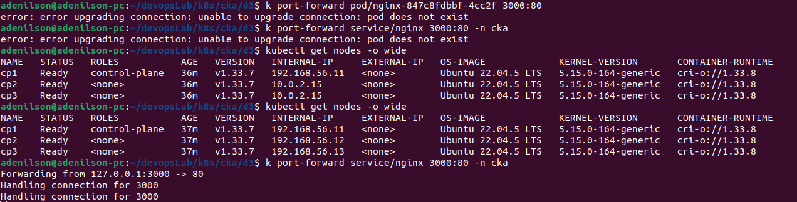

#### Objetivo: Práticar instalação de kubernetes On-premise com KubeADM

### Componentes

- Container Runtime CRI-O
- Kubelet
- Kubectl
- KubeAdm

### Documentação:

- [Como instalar KubeAdm](https://kubernetes.io/docs/setup/production-environment/tools/kubeadm/install-kubeadm/)
- [CRI - Container Runtime Interface](https://kubernetes.io/docs/concepts/containers/cri/)

### Organização de rede

- No kubernetes podemos ter 3 particionamento de rede:
  - Node - Rede "real" onde os nós estão e se comunicam entre sí
  - Pods - Rede que atribui ip aos pods e permitem a comunicação entre sí, cada nó tem sua própria sub-rede
    - Nó A: 10.244.1.0/24
    - Nó B: 10.244.2.0/24
  - Serviço: Rede de IP's virtuais para os services do tipo ClusterIP
    - Nodeport: Usa IP e porta do próprio nó
    - LoadBalancer: Usa de um LB externo ao cluster.
- **Overlap:** Ao particionar a rede é necessário cuidado para não criar duas redes na mesma faixa.

### Kubelet

- Por default o kubelet publicou o ip Nat do virtualbox, oque impede de fazer o port-forward nos serviços.
  pra corrigir apliquei o extra-args com o ip externo da vm.

