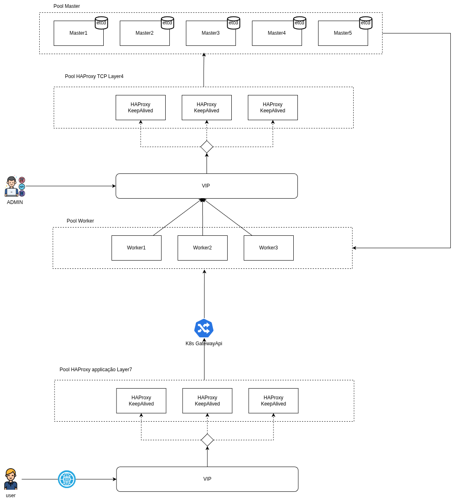

## Kubernetes HA (KubeAdm-Haproxy-Keepalived-Ansible)

### Objetivos:

- Criar cluster kubernetes Com alta disponibilidade usando KubeADM
- Praticar administração de kubernetes on-primises
- Quebrar e concertar componentes.
- Administrar cluster, usuários, backups, DR, etc.
- Automatizar todo o processo usando ansible

#

### Diagrama kubernetes HA



### Tecnologias

- KubeADM - Kubernetes on-premises
- Haproxy - load Balancing
- KeepAlived - para Failover do Haproxy
- Ansible - Para automação e idenpotencia da configuração
- Vagrant - Para automação do VirtualBox
- Shellscript - Instalação base para Ansible

### Documentação:

- [Como instalar KubeAdm](https://kubernetes.io/docs/setup/production-environment/tools/kubeadm/install-kubeadm/)
- [CRI - Container Runtime Interface](https://kubernetes.io/docs/concepts/containers/cri/)
- [etcd](https://etcd.io/docs/v3.4/dev-guide/interacting_v3/)
- [HAproxy Docs](https://www.haproxy.org/)
- [HA - Setup](https://kubernetes.io/docs/setup/production-environment/tools/kubeadm/high-availability/)
- [HA - Topology](https://kubernetes.io/docs/setup/production-environment/tools/kubeadm/ha-topology/)
- [Keepalived topology](https://www.redhat.com/en/blog/haproxy-highly-available-keepalived)
- [Keepalived Docs](https://www.keepalived.org/)
- [Ansible Docs](https://docs.ansible.com/)

### Organização de rede

- No kubernetes podemos ter 3 particionamento de rede:
  - Node - Rede "real" onde os nós estão e se comunicam entre sí
  - Pods - Rede que atribui ip aos pods e permitem a comunicação entre sí, cada nó tem sua própria sub-rede
    - Nó A: 10.244.1.0/24
    - Nó B: 10.244.2.0/24
  - Serviço: Rede de IP's virtuais para os services do tipo ClusterIP
    - Nodeport: Usa IP e porta do próprio nó
    - LoadBalancer: Usa de um LB externo ao cluster.
- **Overlap:** Ao particionar a rede é necessário cuidado para não criar duas redes na mesma faixa.

### Kubelet

- Por default o kubelet publicou o ip Nat do virtualbox, oque impede de fazer o port-forward nos serviços.
  pra corrigir apliquei o extra-args com o ip externo da vm.


### Scripts administrativos (seção em desenvolvimento)

- **[Backup e Restore do ETCD](./cluster-admin/etcd-admin/README.md)**

- **[Gestão de usuários](./cluster-admin/users/README.md)**

### Kubeadm Init

## Como executar

#

### Requisitos

- Ansible
- Vagrant
- virtualbox
- crie um novo arquivo com as senhas de admin do HAproxy em: `./ansible/roles/haproxy/vars/vault.yaml`, atualmente usa senha default admin para decriptografar o vault.
- Encripte esse arquivo usando ansible-vault
- Execute

```shell
  vagrant up
```

- Execute após vagrat subir as vms

```shell
cd ansible/
ansible-playbook main.yaml --ask-vault-pass
```

- Para acessar localmente kubernetes use:
  > Vai baixar o kubeconfig do admin para sua máquina dentro da pasta de playbooks

```shell
ansible-playbook -l control-plane-1 playbooks/take-admin-conf.yaml
```

- Após subir todos os itens execute a aplicação de teste
  > sobre um httpd com nodeport na 30080

```
kubectl apply --kubeconfig=./ansible/playbooks/.kubeconfig -f ./kubernetes/manifests/httpd.yaml
```

- Painel HAproxy deve ficar disponível na 192.168.56.30:8084/stats
- Aplicações devem ficar disponiveis na: 192.168.56.30
