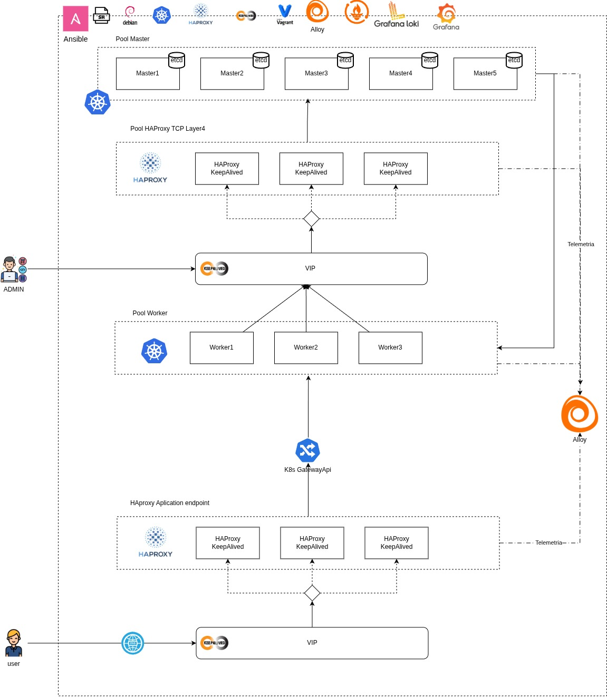
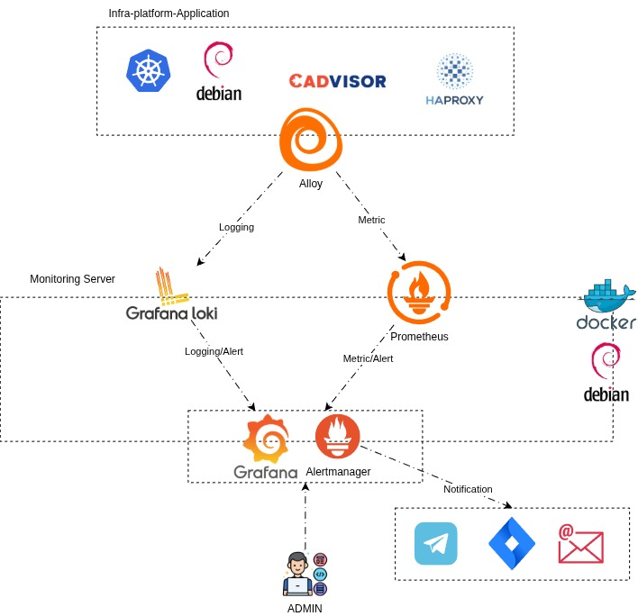
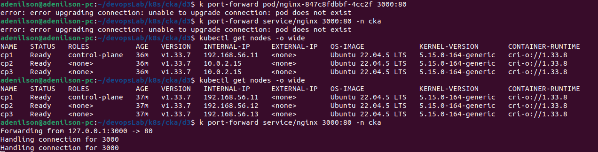
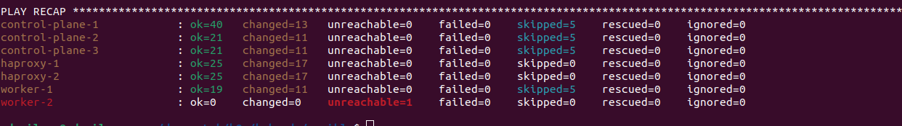
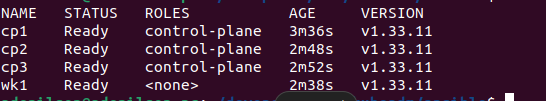
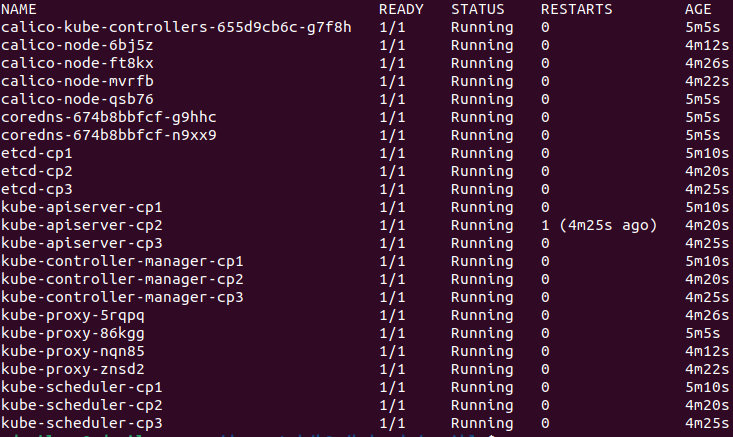
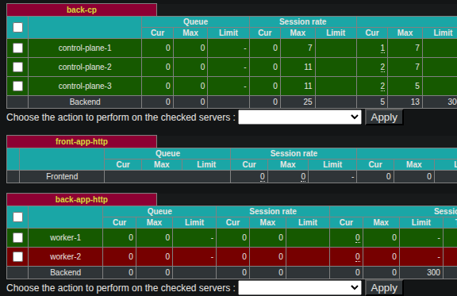

## Kubernetes HA (KubeAdm-Haproxy-Keepalived-Ansible)

### Objetivos:

- Criar cluster kubernetes Com alta disponibilidade usando KubeADM.
- Praticar administração de kubernetes on-primises
- Administrar cluster, usuários, backups, DR, etc.
- Automatizar todo o processo usando ansible (Playboks, toles, vault)

#

### Diagrama kubernetes HA



### Arquitetura de monitoria



[Documentação sobre Monitoria](./obs.md)

### Tecnologias

- KubeADM - Kubernetes on-premises
- Haproxy - load Balancing
- KeepAlived - para Failover do Haproxy
- Ansible - Para automação e idempotência da gestão de configuração
- Vagrant - Para automação do VirtualBox
- Shellscript - Scripts base (refatorados para ansible-playbooks).
- Monitoramento - [Veja aqui](./obs.md)

###

### Documentação:

- [Como instalar KubeAdm](https://kubernetes.io/docs/setup/production-environment/tools/kubeadm/install-kubeadm/)
- [HA - Setup](https://kubernetes.io/docs/setup/production-environment/tools/kubeadm/high-availability/)
- [HA - Topology](https://kubernetes.io/docs/setup/production-environment/tools/kubeadm/ha-topology/)
- [CRI - Container Runtime Interface](https://kubernetes.io/docs/concepts/containers/cri/)
- [etcd](https://etcd.io/docs/v3.4/dev-guide/interacting_v3/)
- [HAproxy Docs](https://www.haproxy.org/)
- [Keepalived topology](https://www.redhat.com/en/blog/haproxy-highly-available-keepalived)
- [Keepalived Docs](https://www.keepalived.org/)
- [Ansible Docs](https://docs.ansible.com/)

### Organização de rede

- No kubernetes podemos ter 3 particionamento de rede:
  - Node - Rede "real" onde os nós estão e se comunicam entre sí
  - Pods - Rede que atribui ip aos pods e permitem a comunicação entre sí, cada nó tem sua própria sub-rede
    - Nó A: 10.244.1.0/24
    - Nó B: 10.244.2.0/24
  - Serviço: Rede de IP's virtuais para os services do tipo ClusterIP
    - Nodeport: Usa IP e porta do próprio nó
    - LoadBalancer: Usa de um LB externo ao cluster.
- **Overlap:** Ao particionar a rede é necessário cuidado para não criar duas redes na mesma faixa.

### Kubelet

- Por default o kubelet publicou o ip Nat do virtualbox, oque impede de fazer o port-forward nos serviços.
  > pra corrigir apliquei o extra-args com o ip externo da vm.



### Scripts administrativos (seção em desenvolvimento)

- **[Backup e Restore do ETCD](./cluster-admin/etcd-admin/README.md)**

- **[Gestão de usuários](./cluster-admin/users/README.md)**

## Como executar

#

### Requisitos

- RAM: 8.25GB / CPU: 10vCpus / Disco: 60GB
- Ansible
- Vagrant
- virtualbox
- crie um novo arquivo com as senhas de admin do HAproxy em: `./ansible/roles/haproxy/vars/vault.yaml`, atualmente usa senha default admin para decriptografar o vault.
- Encripte esse arquivo usando ansible-vault
- Execute

```shell
  vagrant up
```

- Execute após vagrat subir as vms

```shell
cd ansible/
ansible-playbook main.yml --ask-vault-pass
```

- Para acessar localmente kubernetes use:
  > Vai baixar o kubeconfig do admin para sua máquina dentro da pasta de playbooks

```shell
ansible-playbook -l control-plane-1 playbooks/take-admin-conf.yaml
```

- Após subir todos os itens execute a aplicação de teste
  > sobre um httpd com nodeport na 30080

```
kubectl apply --kubeconfig=./ansible/playbooks/.kubeconfig -f ./kubernetes/manifests/httpd.yaml
```

- Painel HAproxy deve ficar disponível na 192.168.56.30:8084/stats
- Aplicações devem ficar disponiveis na: 192.168.56.30

<details>
<summary>Validações</summary>

### O que foi validado

- **Após provisionamento:**

1. Aplicação Idempotente do ansible
   
2. nós do cluster em estado Ready
   
3. pods de sistema saudáveis
   
4. endpoint de API acessível via VIP
5. dashboard/stats do HAProxy disponível
   
6. deploy de workload de teste exposto e acessível no VIP
7. cenário básico de failover com troca de nó ativo do VIP
   - vagrant destroy -f ha1, sem impacto aparente na disponibilidade Dashboard Haproxy e Apiserver.
   - vagrant destroy -f cp1, a destruição de cp valida a reposição de nós, mas devido as restrições de hardware perco o quorum do raft.

</details>

### Erros e lições aprendidas :

#

> > Ansible: Refatorar um processo que já funcionava via shellscript se mostrou mais simples e rápido do que o esperado, e reduziu a curva de aprendizado do Ansible.

1. Idempotência:
   > É a propriedade de uma operação, que a ser executada múltiplas vezes, produz o mesmo resultado.

- Foram necessárias algumas iterações extras para atingir idempotência na instalação, configuração e init dos componentes.
  - Para atingir esse item nos módulos command e shell usei uma task de validação anterior a eles, que gera um register bool para a task de execução real.

2. Trade-off de recursos
   A ideia inicial era mais ambiciosa (external etcd + pools separadas de HAProxy).
   Com limitações de CPU/RAM, optei por stacked etcd e pool compartilhada de HAProxy para manter viabilidade do laboratório.

3. Ansible Templates e arquivos de conf

- Ansible template permite dar dinâmismo aos arquivos de configuração, atraves do uso de variáveis.
- Com o haproxy.cfg, eu quebrei a cabeça por estar tudo certo mas não subir o haproxy até perceber que o arquivo precisa conter uma linha em branco ao final para funcionar, e essa linha não permanecia após aplicar.

4. Refatorar
   - Eu criei esse laboratório durante minha trilha de estudos para CKA, depois refatorei para shellscript, depois para Ansible.
   - Certamente algumas tasks podem ser melhoradas, ou possuem módulos mais adequados além dos command e shell, pois, eu posso ter apenas "traduzido" alguns passos ao invés de fazer rebuild para ansible.

### Próximos Passos:

- Adicionar componente de storage
- Adicionar gestão de usuários via IDP
- Adicionar replicação segura de backups do etcd para local externo.
- Combinar aos outros projetos.
