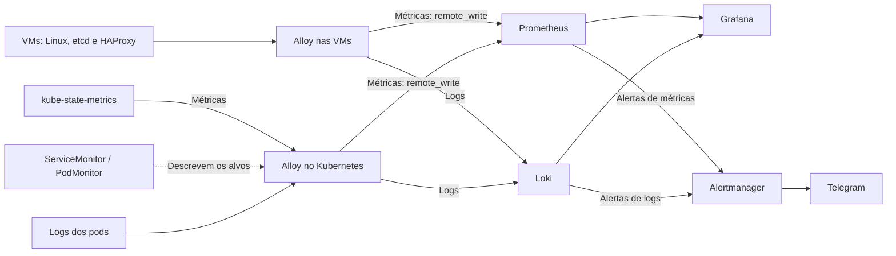

# Kubernetes Stack de Observabilidade

Este laboratório é uma extensão do [laboratório de Kubernetes On-premises HA](./README.md) e contém sua camada integrada de observabilidade.

O objetivo é construir uma solução reproduzível de observabilidade da infraestrutura, capaz de fornecer:

- coleta de métricas Linux;
- métricas de objetos Kubernetes;
- métricas do etcd e do HAProxy;
- centralização de logs de infraestrutura e dos pods;
- visualização através de dashboards do Grafana;
- criação de alertas de métricas e logs, com notificações pelo Telegram.

**Vagrant e Ansible** gerenciam as máquinas e os serviços de infraestrutura. Dentro do Kubernetes, a instalação do Alloy, das CRDs e do kube-state-metrics é realizada pelos comandos Helm e manifests descritos neste documento.

---

## Objetivos

A stack de observabilidade foi adicionada ao laboratório com os seguintes objetivos:

- aplicar conceitos de observabilidade em ambientes Kubernetes;
- centralizar métricas e logs da infraestrutura;
- observar componentes críticos do control plane;
- acompanhar a saúde do cluster etcd;
- monitorar os load balancers;
- automatizar o provisionamento da plataforma;
- manter dashboards, regras e configurações versionados;
- preservar os dados durante atualizações dos containers;
- criar uma base para estudos de troubleshooting e reliability.

O **foco principal** é a **integração** entre os componentes de observabilidade e a infraestrutura. Por limitações de recursos, os serviços centrais de observabilidade executam em um único servidor, sem redundância.

## Diagrama de Arquitetura


A coleta acontece em dois contextos: o Alloy instalado como serviço nas VMs e o Alloy instalado dentro do Kubernetes. Ambos enviam dados ao servidor de observabilidade `192.168.56.41`, onde Prometheus, Loki, Grafana e Alertmanager executam em Docker Compose.



Os endereços de destino são parametrizados na configuração do Alloy. No laboratório, os valores usados são:

| Serviço       | Endereço                          | Uso                                                   |
| ------------- | --------------------------------- | ----------------------------------------------------- |
| Prometheus    | `http://192.168.56.41:9090`       | Consultas de métricas; recebimento em `/api/v1/write` |
| Loki          | `http://192.168.56.41:3100`       | Consultas de logs; recebimento em `/loki/api/v1/push` |
| Grafana       | `http://192.168.56.41:3000`       | Dashboards e Explore                                  |
| Alertmanager  | `http://192.168.56.41:9093`       | Consulta e gerenciamento de alertas                   |
| HAProxy Stats | `http://192.168.56.30:8404/stats` | Painel do balanceador pelo VIP                        |

Os containers centrais se comunicam pela rede Docker `monitoring`, usando os nomes dos serviços, como `prometheus`, `loki` e `alertmanager`.

## Stack

1. Alloy — coletor de métricas e logs nas VMs e no Kubernetes.
2. Loki — armazenamento, consulta e regras de alerta de logs.
3. Prometheus — armazenamento de métricas, recording rules e regras de alerta.
4. Grafana — dashboards e exploração dos dados.
5. Alertmanager — agrupamento e encaminhamento de alertas.
6. kube-state-metrics — exposição de métricas sobre objetos Kubernetes.
7. Ansible — provisionamento e configuração dos serviços nas VMs.
8. Helm e manifests — instalação e configuração dos componentes dentro do Kubernetes.

## Documentação

- [Ansible Collection Grafana](https://github.com/grafana/grafana-ansible-collection)
- [Ansible Role Alloy](https://galaxy.ansible.com/ui/repo/published/grafana/grafana/content/role/alloy/)
- [Configuração Alloy para Prometheus](https://grafana.com/docs/alloy/latest/reference/components/prometheus/)
- [Alertmanager](https://prometheus.io/docs/alerting/latest/configuration/)
- [Monitoramento do etcd](https://etcd.io/docs/v3.4/op-guide/monitoring/)
- [Artifact Hub](https://artifacthub.io/)

## Componentes

### Alloy Collector

- Justificativa:
  - Usado como coletor comum para métricas e logs, integrado à stack Grafana.
  - Faz scrape de endpoints no formato Prometheus e encaminha métricas por `remote_write`.
  - Permite acrescentar fontes de telemetria conforme o componente monitorado.
  - Traces são uma possibilidade de extensão; não fazem parte do fluxo descrito neste laboratório.

- Configuração e instalação nas VMs:
  - A [role alloy](./ansible/roles/alloy/tasks/main.yml) utiliza `grafana.grafana.alloy` para instalar o agente e aplicar a configuração inicial comum de métricas Linux e logs.
  - Cada role de componente importa `configure_observability.yaml` e renderiza seu `config.alloy.j2` em `/etc/alloy/config.alloy`.
  - O template gera o arquivo completo, combinando os blocos comuns com a coleta específica do componente. Os blocos comuns e os destinos de envio são compartilhados para manter consistência entre os hosts.
  - Quando o conteúdo muda, a task notifica o handler `Restart Alloy`. Uma reaplicação sem alteração de conteúdo não dispara esse reinício pela task de template.
  - A configuração dos workers é aplicada com a condição `worker_join`, mantendo somente as fontes apropriadas ao host.

| Role                         | Métricas Linux | Coleta específica                               |
| ---------------------------- | -------------- | ----------------------------------------------- |
| `haproxy`                    | Sim            | HAProxy em `127.0.0.1:8405/metrics` e seus logs |
| `kubeadm_init`               | Sim            | Logs e etcd em `127.0.0.1:2381/metrics`         |
| `kubeadm-control-plane-join` | Sim            | Logs e etcd em `127.0.0.1:2381/metrics`         |
| `kubeadm-worker-join`        | Sim            | Logs dos serviços do worker                     |
| `obs_server`                 | Sim            | Logs do próprio servidor                        |

O bloco `prometheus.exporter.unix` fornece métricas Linux, coletadas pelo `prometheus.scrape`. Os scrapes específicos do HAProxy e do etcd identificam o componente pelo label `job` e a máquina pelo label `instance`. Os endpoints locais precisam estar disponíveis no host correspondente.

- Configuração dentro do Kubernetes:
  - O [values.yml](./kubernetes/alloy/values.yml) configura o Alloy instalado via Helm.
  - `prometheus.operator.servicemonitors` e `prometheus.operator.podmonitors` descobrem os alvos descritos pelos respectivos recursos e encaminham as métricas para o Prometheus externo.
  - `discovery.kubernetes` descobre os pods; `discovery.relabel` atribui labels; `loki.source.kubernetes` coleta seus logs e os envia ao Loki.

### Prometheus

- Justificativa:
  - Backend central de métricas e responsável por avaliar recording rules e regras de alerta.
  - Recebe as métricas coletadas pelos agentes Alloy das VMs e do Kubernetes.

- Instalação e configuração:
  - Instalado pela [role obs_server](./ansible/roles/obs_server/tasks/main.yml), junto dos demais serviços do Docker Compose.
  - Inicia com `--web.enable-remote-write-receiver`, habilitando `/api/v1/write`.
  - O scrape direto configurado no servidor central é o próprio Prometheus, a cada 5 segundos. Os demais alvos são coletados pelo Alloy.
  - Carrega as regras versionadas em [files/prometheus/rules](./ansible/roles/obs_server/files/prometheus/rules).
  - Mantém as séries temporais em armazenamento persistente, reutilizado nas atualizações dos containers.

As recording rules calculam métricas derivadas de CPU, memória, mudanças de liderança e latência de escrita do etcd. As regras de alerta usam esses resultados para identificar:

> Não foi criado um volume grande de métricas, mas uma base conceitual para evoluior

| Condição                         | Critério configurado                                                          |
| -------------------------------- | ----------------------------------------------------------------------------- |
| CPU elevada                      | Uso acima de 80% por 5 minutos                                                |
| Memória elevada                  | Uso acima de 80% por 5 minutos                                                |
| etcd sem líder                   | Nenhum membro coletado indica líder por 1 minuto                              |
| Mudanças frequentes de liderança | Mais de 5 mudanças na janela de 5 minutos, com condição mantida por 5 minutos |
| Latência de escrita do etcd      | Percentil 99 de `fsync` acima de 0,5 segundo por 5 minutos                    |

Os alertas são enviados ao Alertmanager. Ausência de dados de coleta deve ser investigada separadamente: não é equivalente a uma métrica coletada indicando falha.

### Loki

- Justificativa:
  - Backend central de logs de infraestrutura e de pods.
  - Integrado ao Grafana como datasource, permitindo consultas pelo Explore.
  - Avalia regras de alerta baseadas em consultas de logs pelo ruler. (em refatoração)

- Instalação e configuração:
  - Executa no Docker Compose.
  - Recebe logs pelo endpoint `/loki/api/v1/push`.
  - As regras de logs são provisionadas junto da configuração.
  - O ruler encaminha alertas para `http://alertmanager:9093`, usando o hostname e a porta renderizados pelas variáveis do template.

### Prometheus Alertmanager

- Justificativa:
  - Recebe alertas de Prometheus e Loki, agrupa eventos relacionados e encaminha notificações ao Telegram.
  - Havia a possibilidade de usar o próprio grafana para alertas, mas optei pelo prometheus pra poder entender melhor essa ferramenta e manter regras versionadas.

- Configuração:
  - Agrupa por `alertname`, `cluster` e `namespace`, quando esses labels estão presentes.
  - Aguarda inicialmente 30 segundos para agrupar os alertas antes de notificar.
  - Usa intervalo de grupo de 5 minutos e intervalo de repetição de 30 minutos.
  - Envia notificações de alerta ativo e de resolução.
  - Token do bot e ID do chat são carregados pelas variáveis do Ansible Vault da role `obs_server`.

O Alertmanager encaminha as notificações; a avaliação da condição ocorre no Prometheus ou no ruler do Loki. A mensagem inclui severidade, componente, resumo, descrição e horário de início.

### Grafana Dashboards

- Justificativa:
  - Centraliza a visualização das métricas e a exploração dos logs.
  - Permite relacionar sintomas de infraestrutura, estado do Kubernetes e comportamento do etcd e dos balanceadores.
  - Permite visualizar regras de alertas.

- Instalação e configuração:
  - Datasources Prometheus e Loki são provisionados automaticamente, usando os nomes dos serviços na rede Docker.
  - Os [dashboards versionados](./ansible/roles/obs_server/files/dashboards) são copiados pela role `obs_server` e carregados por um provider de arquivos.
  - Há dashboards para Linux, HAProxy, etcd e métricas Kubernetes.
  - O banco e os demais dados do Grafana possuem persistência própria, além dos arquivos de provisionamento e dashboards.

### Kube-state-metrics

- Expõe métricas sobre objetos Kubernetes, como pods, deployments e réplicas, complementando as métricas Linux coletadas nas VMs.
- O [ServiceMonitor](./kubernetes/monitoring/service_monitor.yml) seleciona Services em `kube-system` com o label `app.kubernetes.io/name: kube-state-metrics`.
- A coleta usa `/metrics`, na porta nomeada `http`, com intervalo de 15 segundos.
- O Alloy interpreta o ServiceMonitor, coleta o endpoint e envia as métricas ao Prometheus externo.

As CRDs disponibilizam os tipos `ServiceMonitor` e `PodMonitor`; é necessário criar os objetos de monitoramento para descrever os alvos. Nesse fluxo, o Alloy realiza a coleta, sem exigir uma instância de Prometheus no cluster.

> Aqui há espaço para evolução, ou seja, coletar metricas de aplicações usando os monitors e o alloy como collector.

### Logging

[Documentação Kubernetes sobre conceitos de logging](https://kubernetes.io/docs/concepts/cluster-administration/logging/)

- Nas VMs:
  - O journal fornece logs dos serviços systemd, como kubelet e o runtime presente no host.
  - Arquivos como `syslog`, `auth.log` e `kern.log` são selecionados conforme o ambiente.
  - `haproxy.log` é incluído nos hosts que executam HAProxy.
  - Os registros recebem labels como `host`, `log_type` e `unit`, conforme a fonte.

- No Kubernetes:
  - O Alloy descobre os pods e coleta seus logs pela integração com a API Kubernetes.
  - Os labels `namespace`, `pod`, `container` e `node` permitem localizar a origem dos registros.

Para acrescentar uma fonte, atualizar a configuração correspondente, aplicar o provisionamento e conferir a chegada dos registros ao Loki. A configuração final de cada host contém apenas as fontes previstas para seus componentes.

## Provisionamento e persistência

A role `obs_server` instala Docker e Compose, cria a estrutura em `/monitoring`, renderiza as configurações, copia dashboards e regras e configura o Alloy do próprio servidor.

| Serviço      | Dados preservados entre recriações                             |
| ------------ | -------------------------------------------------------------- |
| Prometheus   | Séries temporais e estado do armazenamento                     |
| Loki         | Dados e índices de logs, com caminhos coerentes com os volumes |
| Grafana      | Banco de dados e demais dados persistentes                     |
| Alertmanager | Estado, incluindo silêncios                                    |

Configurações, regras e dashboards permanecem versionados e são provisionados em seus caminhos próprios. Os diretórios de dados têm permissões compatíveis com os processos dos containers.

As atualizações aplicam recarga ou reinício ao serviço afetado, conforme a mudança. Alterações localizadas não exigem derrubar toda a stack. Os handlers do Alloy também respeitam a alteração de conteúdo do arquivo renderizado.

## Instalação no Kubernetes

Executar os comandos abaixo **a partir da raiz do repositório**, com Helm e kubectl disponíveis e o kubeconfig apontando para o cluster do laboratório. A infraestrutura deve estar provisionada, os nós acessíveis pela rede privada e o servidor central alcançável nas portas `9090` e `3100` a partir do ambiente Kubernetes.

1. Adicionar os repositórios Helm:

```sh
helm repo add grafana https://grafana.github.io/helm-charts
helm repo add prometheus-community https://prometheus-community.github.io/helm-charts
helm repo update
```

2. Instalar as CRDs antes dos componentes que usam ServiceMonitor e PodMonitor:

```sh
helm upgrade --install prometheus-operator-crds \
  prometheus-community/prometheus-operator-crds \
  --namespace monitoring --create-namespace --wait
```

3. Instalar o Alloy com a configuração do laboratório:

```sh
helm upgrade --install alloy grafana/alloy \
  --namespace alloy --create-namespace \
  -f ./kubernetes/alloy/values.yml --wait
```

4. Instalar o kube-state-metrics:

```sh
helm upgrade --install kube-state-metrics \
  prometheus-community/kube-state-metrics \
  --version 8.4.1 --namespace kube-system --wait
```

5. Aplicar o ServiceMonitor:

```sh
kubectl apply -f ./kubernetes/monitoring/service_monitor.yml
```

O Service instalado deve corresponder ao label e à porta nomeada do ServiceMonitor. Para outros componentes, criar ServiceMonitors ou PodMonitors apropriados e validar os endpoints descobertos pelo Alloy.

## Validações

Os passos abaixo são um roteiro de verificação do ambiente provisionado, não um registro de testes executados.

### Provisionamento e descoberta

- Conferir se o inventário corresponde às VMs do perfil escolhido e se há workers para os workloads de teste.
- Conferir se os nós anunciam os IPs privados esperados:

```sh
kubectl get nodes -o wide
kubectl get pods -n alloy -o wide
kubectl get pods -n kube-system -l app.kubernetes.io/name=kube-state-metrics
kubectl get svc -n kube-system -l app.kubernetes.io/name=kube-state-metrics -o yaml
kubectl get servicemonitor -n kube-system kube-state-metrics -o yaml
```

- Nas VMs, conferir `/etc/alloy/config.alloy` e os logs do serviço:

```sh
systemctl status alloy
journalctl -u alloy --since '10 minutes ago'
```

- Confirmar que HAProxy é coletado apenas nos balanceadores e etcd apenas nos control planes.
- Confirmar que os componentes de descoberta do Alloy no Kubernetes não apresentam erros de acesso às CRDs ou à API.

### Métricas e logs

- No Prometheus, consultar séries Linux, como `node_cpu_seconds_total`, séries etcd, como `etcd_server_has_leader`, e métricas de objetos, como `kube_pod_info`.
- Conferir métricas do HAProxy pelo label `job="haproxy"` e os scrapes recebidos pela consulta `up`.
- Verificar os alvos no Alloy: a página de targets do Prometheus central não lista os scrapes feitos pelos agentes e enviados via `remote_write`.
- No Grafana Explore, consultar logs por `host` ou `unit` para VMs e por `namespace`, `pod` ou `container` para Kubernetes.
- Confirmar que os dashboards usam os labels presentes nas séries recebidas.

### Alertas e notificações

- Verificar o carregamento das recording rules e das regras de alerta no Prometheus.
- Em um exercício controlado, disparar um alerta de métricas e acompanhar sua chegada ao Alertmanager e ao Telegram.
- Repetir a verificação com uma regra de logs do Loki, usando registros de teste que satisfaçam sua condição.
- Confirmar as notificações de resolução após a condição deixar de ocorrer.

### Atualizações, persistência e disponibilidade

- Aplicar uma mudança localizada e conferir que apenas o serviço afetado recebe recarga ou reinício.
- Reaplicar a configuração sem alterações e conferir que a task de template não solicita reinício do Alloy.
- Em ambiente de teste, recriar os containers preservando seus volumes e verificar a continuidade do histórico de métricas, logs e dados do Grafana.
- No perfil completo, validar separadamente a troca do balanceador ativo e a perda de um membro de etcd, acompanhando métricas e alertas.
- Tratar indisponibilidade do servidor central como limite do laboratório, mesmo quando o cluster Kubernetes continua operacional.

## Conclusão geral sobre o porque das decisões dessa stack

Optei pelo Alloy para padronizar a coleta de métricas e logs nas VMs
e no Kubernetes. Essa escolha permite incorporar novas fontes de
telemetria reutilizando o mesmo coletor, reduzindo a variedade de
agentes que preciso configurar, atualizar e manter.

O objetivo foi construir uma base que possa evoluir com a
infraestrutura e as aplicações, mantendo o esforço de operação
compatível com o laboratório. Novos endpoints podem ser incorporados
pelos templates dos componentes ou por ServiceMonitors e PodMonitors,
aproveitando os destinos de métricas e logs já existentes.

A coleta de traces é uma possibilidade futura. O Alloy pode participar
desse fluxo, mas sua adoção também exige definir a instrumentação e o
backend de armazenamento e consulta.

A escolha por Prometheus e Alertmanager também atende ao objetivo de
aprendizado, com regras versionadas e responsabilidades explícitas
entre avaliação de condições e envio de notificações. Ansible,
templates e dashboards versionados ajudam a reproduzir e manter
essa configuração.

Como ambientes de TI mudam continuamente, a intenção é controlar o
crescimento da complexidade operacional. A ausência de redundância
nos serviços centrais é uma decisão consciente para adequar o
laboratório aos recursos disponíveis.

### Próximos Passos:

- [Próximos Passos](./next-steps.md)
