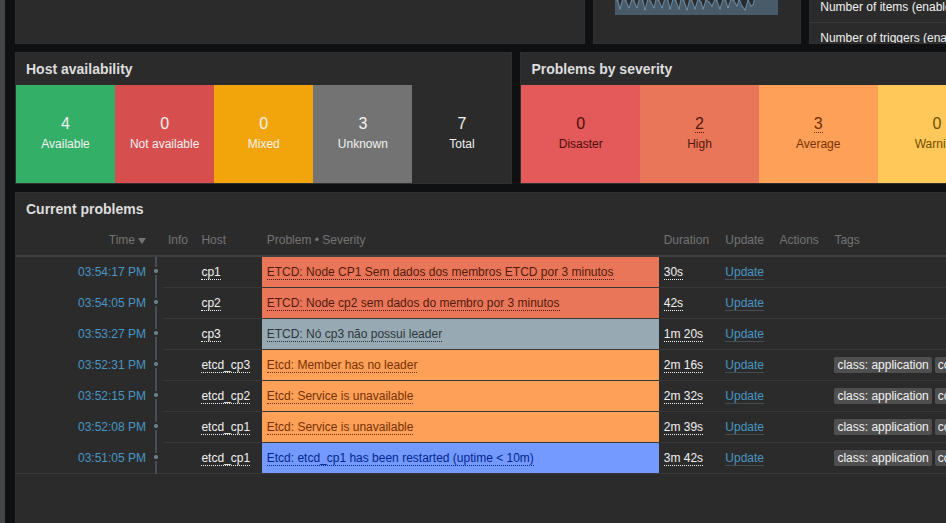
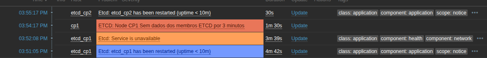
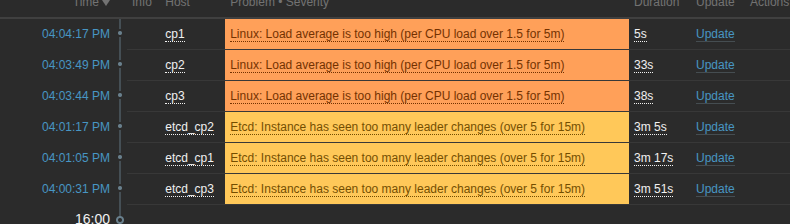
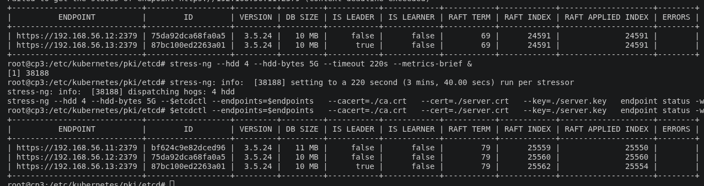

### Monitoria ETCD

- Quando há muitas eleições indicando instabilidade no ambiente
  > Comando usado para gerar instabilidade `stress-ng --hdd 4 --hdd-bytes 5G --timeout 220s --metrics-brief &`
- 
- Nesse caso tivemos 10 eleições em poucos minutos
  
